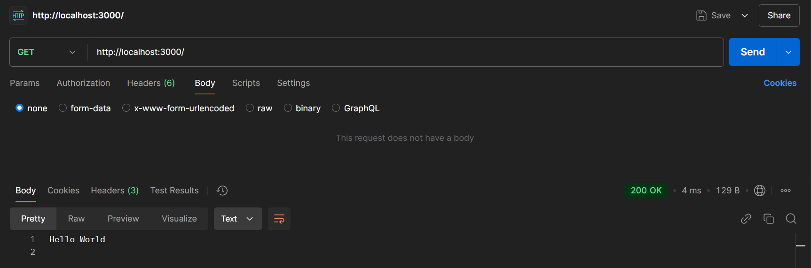
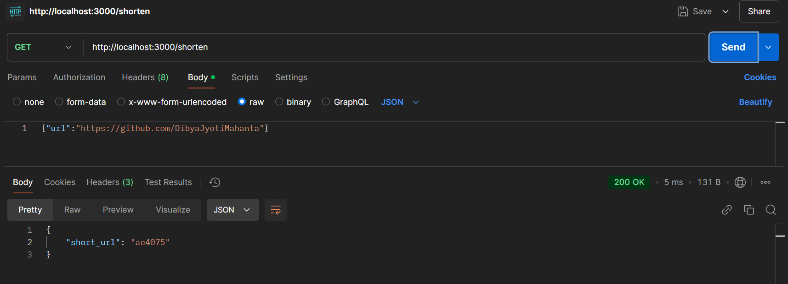
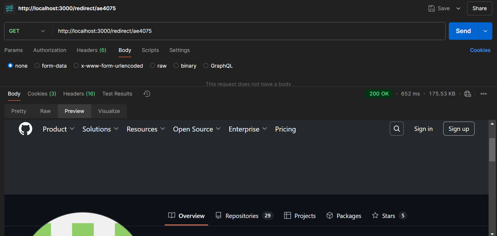

# EncodedURL

A lightweight and efficient URL Shortener built in **Go**. This application allows users to create short URLs and redirect them to their original destinations.

---

## Features

- 🔗 **Shorten URLs**: Quickly generate short and unique URLs.
- 🚀 **Redirection**: Redirect short URLs to their original URLs.
- 🗂️ **In-Memory Storage**: Stores URLs in memory (can be extended to use a database).
- ⏰ **Timestamping**: Keeps track of URL creation time.

---

## Tech Stack

- [Go](https://golang.org/) - Backend programming language.
- [MD5 Hashing](https://pkg.go.dev/crypto/md5) - Used for generating short and unique hashes.
- [HTTP Package](https://pkg.go.dev/net/http) - For handling requests and responses.

---

## Getting Started

### Prerequisites

- Install [Go](https://golang.org/doc/install) on your machine.
- Ensure you have a terminal or command prompt set up for running Go programs.

### Installation

1. Clone the repository:
   ```bash
   git clone https://github.com/your-username/url-shortener.git
   cd url-shortener
   ```

2. Run the application:
   ```bash
   go run main.go
   ```

3. The server will start at [http://localhost:3000](http://localhost:3000).

---

## API Endpoints

### 1. Root Endpoint

- **URL**: `/`
- **Method**: `GET`
- **Description**: Displays a simple welcome message.
- **Response**:
  ```plaintext
  Hello World
  ```
  

  

### 2. Shorten URL

- **URL**: `/shorten`
- **Method**: `POST`
- **Description**: Generates a short URL.
- **Request Body**:
  ```json
  {
      "url": "<original_url>"
  }
  ```
- **Response**:
  ```json
  {
      "short_url": "<shortened_url_id>"
  }
  ```
- **Example**:
  ```bash
  curl -X POST -H "Content-Type: application/json" -d '{"url": "https://example.com"}' http://localhost:3000/shorten
  ```


### 3. Redirect to Original URL

- **URL**: `/redirect/{short_url_id}`
- **Method**: `GET`
- **Description**: Redirects the user to the original URL corresponding to the short URL ID.
- **Example**:
  ```bash
  curl http://localhost:3000/redirect/1a2b3c
  ```


---

## Example Workflow

1. Send a POST request to `/shorten` with the original URL.
2. Receive the short URL ID.
3. Use `/redirect/{short_url_id}` to access the original URL.

---
